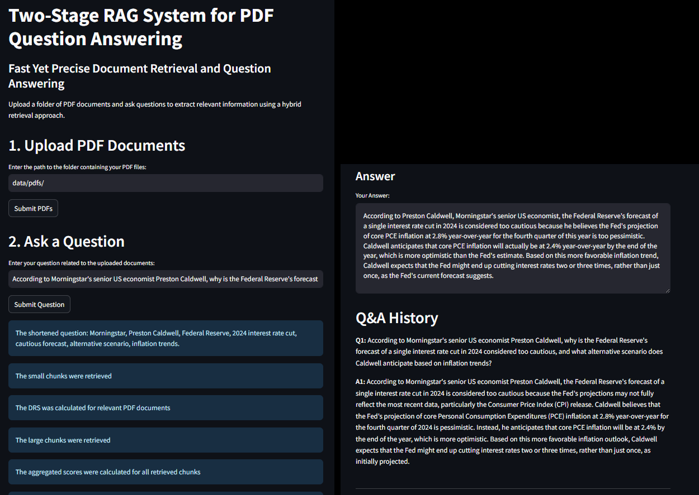
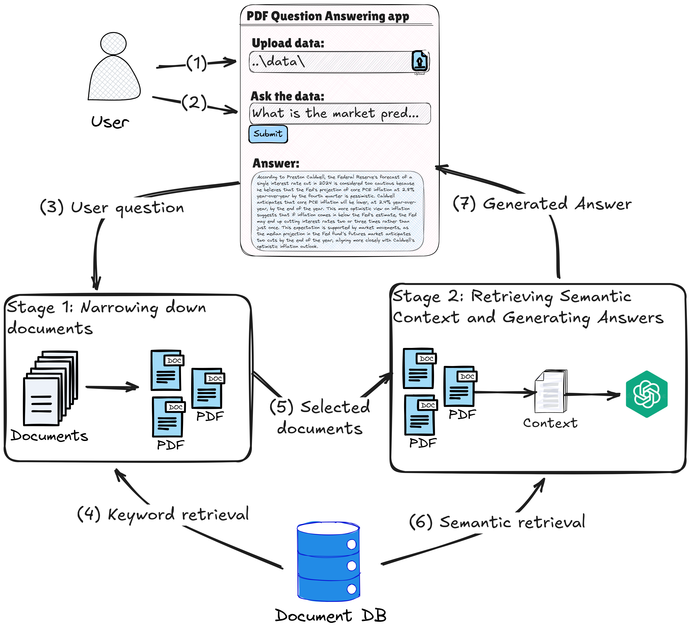

# Two-Stage Consecutive RAG System for Document QA: Enhancing Precision and Scalability



*Figure: Screenshot of the PDF Question Answering System Dashboard.*

## Table of Contents
- [Introduction](#introduction)
- [System Overview](#system-overview)
- [Installation and Setup](#installation-and-setup)
- [Usage](#usage)
- [Future Enhancements](#future-enhancements)
- [Conclusion](#conclusion)
- [License](#license)

---

## Introduction

The **Two-Stage Consecutive RAG** pipeline optimizes both precision and scalability by employing a sequential retrieval strategy that leverages the strengths of both keyword-based and semantic search while minimizing computational overhead. The user can upload PDF documents and interactively ask questions about their content. By leveraging a two-staged retrieval approach, the system processes documents, retrieves relevant information, and provides precise responses based on the uploaded content.

For a detailed explanation of the system, its design, and performance evaluation, check out the complete blog post: [Two-Stage Consecutive RAG for Document QA](https://medium.com/@bbkhosseini/two-stage-consecutive-rag-for-document-qa-enhancing-precision-and-scalability-ac2af206babd).


## System Overview



### Workflow Summary

1. **Document Loading and Chunking**: Users upload PDFs, which are split into both small and large text chunks. Small chunks capture specific information and keyword matches, while large chunks provide broader context.
2. **Vector Store Creation**: Large text chunks are embedded using a sentence transformer model and indexed in a vector database (ChromaDB) for efficient semantic search.
3. **Question Shortening**: User query is condensed into essential keywords using an LLM. 
4. **BM25 Keyword Search:** A keyword search is performed using the BM25 algorithm on small chunks and the condensed keywords. A Cross-Encoder is used to rerank retrieved chunks based on semantic similarity.
5. **DRS Calculation:** Aggregates small chunk scores to calculate a document retrieval score (DRS) and select top relevant documents.
6. **Semantic Search:** Performs semantic search on large chunks within selected documents, and a Cross-Encoder Reranking further refines the relevance of retrieved chunks.
7. **Context Aggregation:** Aggregates and ranks both small and large chunks based on their scores to form the final context.
8. **Answer Generation**: The system generates a response based on the construcred context and the input query.

For details on backend components and architecture, see [backend/README.md](backend/README.md).

## 🗂️ Project Structure


```
two-stage-conrag/
├── backend/                  # Core logic: PDF manager, retrievers, QA chains, settings
│   ├── my_lib/              # Modular pipeline components
│   ├── settings.py
│   ├── tools.py
│   ├── utils.py
│   └── requirements.txt     # Optional backend pip-only fallback
├── frontend/                # Streamlit interface
│   ├── app.py
│   ├── helper_gui.py
│   └── requirements.txt     # Optional frontend pip-only fallback
├── vector_store/            # Embedding DB client and index config
├── configs/                 # YAML configuration files
│   └── config.yaml
├── data/                    # Sample and full-scale PDF sets
│   └── sample_pdfs/
├── notebooks/               # Prototyping and experimentation
├── .env_example             # Template for secrets and API keys
├── Dockerfile               # Production-ready Dockerfile (Poetry-free runtime)
├── Makefile                 # CLI shortcuts for dev/test/deploy
├── requirements.txt         # Auto-generated fallback for pip
├── pyproject.toml           # Poetry project definition
├── poetry.lock              # Locked dependencies
└── README.md                # Project overview and instructions
```

---

## 🚀 Installation and Setup

### 1. Clone the Repository

```bash
git clone https://github.com/yourusername/two-stage-conrag.git
cd two-stage-conrag
```

### 2. Python Environment Setup

Ensure Python 3.12.0 is installed. If needed, use [pyenv](https://github.com/pyenv/pyenv):

```bash
pyenv install 3.12.0
pyenv local 3.12.0
```

### 3. Configure Environment Variables

Copy the template file and set your API keys:

```bash
cp .env_example .env
```

Then edit `.env` and add:

```env
OPENAI_API_KEY=your-key-here
# Optional: LANGCHAIN_API_KEY=your-langsmith-key
```

### 4. Install Dependencies (Choose One)

#### ✅ Option A — Recommended: Poetry

> 📦 **Poetry must be installed on your system.**
> Install it via [official guide](https://python-poetry.org/docs/#installation) or with:
>
> ```bash
> curl -sSL https://install.python-poetry.org | python3 -
> ```

Once Poetry is available:

```bash
make install  # Equivalent to: poetry install
```

This installs dependencies into an isolated virtual environment based on `pyproject.toml`.

> To activate the environment manually:
>
> ```bash
> poetry shell
> ```

---

#### ⚙️ Option B — Fallback: pip with requirements.txt

If you don’t have Poetry or need a quick pip install:

```bash
python -m venv .venv
source .venv/bin/activate
pip install -r requirements.txt
```

> The `requirements.txt` is generated from `poetry.lock` using:
>
> ```bash
> make export-reqs
> ```

---

#### 🐳 Option C — Run via Docker (Portable)

Build and run the app inside a Docker container:

```bash
# Build image
make docker-build

# Run Streamlit app
make docker-run
```

This method skips Poetry and uses pip internally with a pinned `requirements.txt` exported from Poetry.


**Note:** The current Docker setup does not support the local model (`llama-cpp-python`) due to build constraints. If you require this functionality, please run the application in a local environment as described in the sections above.

---

## 🧪 Usage

### Running the Application (Local Environment)

Once your environment is ready:

```bash
source .venv/bin/activate  # Activate the environment manually
make run                   # Launch the Streamlit app
```

### Running the Application (Docker)

```bash
make docker-run
```

Then visit [http://localhost:8501](http://localhost:8501) in your browser to use the dashboard.


### Using the Application

1. **Upload PDFs**: Place your documents in a folder (e.g., `data/pdfs_files/`) and provide the path when prompted. Click "Submit PDFs" to ingest them.
2. **Ask Questions**: Once the PDFs are processed, type your question in the question box. The system will return an answer based on the ingested content.

### Sample and Full-Scale PDF Datasets
The repository includes a sample PDF dataset located in the `data/sample_pdfs/` folder. This dataset contains 5 PDF files that can be used for a quick test of the system without any additional setup.

**Note:** These sample PDF files are sourced from [Morningstar](https://www.morningstar.com/) website, containing market predictions and reviews. They are included solely for demonstration and testing purposes.

For a more extensive test, a full-scale PDF dataset (approximately 150 MB) is available. You can download it from this [Google Drive link](https://drive.google.com/drive/u/0/folders/1589yvpk4M4uMmMqOE-jjZ73WoptuvPdV).

---

## Future Enhancements

- **Agentic Pipelines**: Introduce agent-based mechanisms to dynamically adjust retrieval strategies based on query complexity.
- **Advanced Refinement Loops**: Utilize techniques like retrieval grading and self-RAG to iteratively improve the quality of the final answer.
- **Advanced Context Fusion**: Implement sophisticated methods to combine retrieved information chunks more effectively.
- **Self-RAG Mechanisms**: Enable the system to self-improve by generating new retrieval queries based on past performance.
- **Extensive Metadata**: Enrich documents with additional metadata to improve retrieval precision.
- **Hierarchical Structure**: Incorporate hierarchical layers of information within the corpus.
- **Domain-Specific Optimizations**: Customize chunk sizes and retrieval models for specific industries or document types.
- **Advanced Parsing**: Enhance document processing to handle complex structures like tables and images.

## Conclusion

The Two-Stage Consecutive RAG system delivers a scalable and precise solution for document-based question answering by combining keyword and semantic retrieval in a sequential pipeline. This hybrid approach ensures accurate and context-aware answers, even when working with large-scale, complex document collections.


## License
This project is licensed under the MIT License. See the [LICENSE](LICENSE) file for details.

## Contributing

Contributions, suggestions, or feature requests are welcome!

If you'd like to contribute:
- Fork the repository
- Create a new branch (`git checkout -b feature/your-feature-name`)
- Commit your changes and open a pull request

Please ensure any new code is well-documented and tested.

## Contact

For questions, feedback, or collaboration opportunities, feel free to reach out:

- 📧 Email: [bbkhosseini@gmail.com](mailto:bbkhosseini@gmail.com)
- 🌐 LinkedIn: [https://www.linkedin.com/in/bhosseini/](https://www.linkedin.com/in/bhosseini/)
- 🧑‍💻 GitHub: [https://github.com/bab-git](https://github.com/bab-git)
